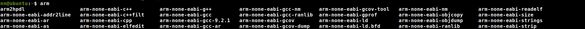

# Set arm-none-eabi-gdb
```sh
sudo apt install binutils-arm-none-eabi gcc-arm-none-eabi
```



# Set Rust Crotex-M4 toolchians

```none
rustup target add thumbv7em-none-eabi
```

| RT-Core                  | Signature | Board |
| ------------------------ | --------- | --------- |
| Cortex-M0 and Cortex-M0+ | thumbv6m-none-eabi ||
| Cortex-M3                | thumbv7m-none-eabi ||
| Cortex-M4 and Cortex-M7 (no FPU) | thumbv7em-none-eabi ||
| Cortex-M4F and Cortex-M7F (with FPU) | thumbv7em-none-eabihf ||

# Set OpenOCD

```
sudo apt install openocd
```

| OCD cmd                                                      | Board         |
| ------------------------------------------------------------ | ------------- |
| openocd -f interface/stlink-v2.cfg -f target/stm32f4x_stlink.cfg | STM32F407ZGT6 |

