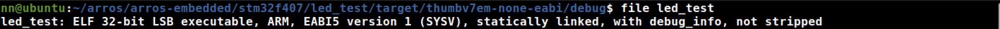

⏰ 2020.12.01

### 1. create a new cargo project called `led_test` 

cargo new led_test

### 2. cargo check

```shell
nn@ubuntu:~/arros/arros-embedded/stm32f407/led_test$ cargo check
    Checking stable_deref_trait v1.2.0
    Checking vcell v0.1.2
    Checking bitfield v0.13.2
    Checking r0 v0.2.2
    Checking panic-halt v0.2.0
    Checking typenum v1.12.0
    Checking bare-metal v0.2.5
    Checking volatile-register v0.2.0
    Checking cortex-m-rt v0.6.13
    Checking generic-array v0.13.2
    Checking generic-array v0.14.4
    Checking generic-array v0.12.3
    Checking as-slice v0.1.4
    Checking aligned v0.3.4
    Checking cortex-m v0.6.4
    Checking cortex-m-semihosting v0.3.5
    Checking stm32f4 v0.12.1
    Building [=====================================================>   ] 43/45: stm32f4
```

### 3. cargo build
```sh
nn@ubuntu:~/arros/arros-embedded/stm32f407/led_test$ cargo clean
nn@ubuntu:~/arros/arros-embedded/stm32f407/led_test$ cargo build --target thumbv7em-none-eabi
   Compiling typenum v1.12.0
   Compiling semver-parser v0.7.0
   Compiling version_check v0.9.2
   Compiling proc-macro2 v1.0.24
   Compiling cortex-m v0.6.4
   Compiling unicode-xid v0.2.1
   Compiling stable_deref_trait v1.2.0
   Compiling syn v1.0.53
   Compiling vcell v0.1.2
   Compiling bitfield v0.13.2
   Compiling cortex-m-rt v0.6.13
   Compiling r0 v0.2.2
   Compiling stm32f4 v0.12.1
   Compiling cortex-m-semihosting v0.3.5
   Compiling panic-halt v0.2.0
   Compiling volatile-register v0.2.0
   Compiling semver v0.9.0
   Compiling generic-array v0.14.4
   Compiling rustc_version v0.2.3
   Compiling bare-metal v0.2.5
   Compiling quote v1.0.7
   Compiling generic-array v0.13.2
   Compiling generic-array v0.12.3
   Compiling as-slice v0.1.4
   Compiling aligned v0.3.4
   Compiling cortex-m-rt-macros v0.1.8
   Compiling led_test v0.1.0 (/home/nn/arros/arros-embedded/stm32f407/led_test)
    Finished dev [unoptimized + debuginfo] target(s) in 34.28s

```

### 4. Check the final bianry 

```
nn@ubuntu:~/arros/arros-embedded/stm32f407/led_test/target/thumbv7em-none-eabi/debug$ file led_test
led_test: ELF 32-bit LSB executable, ARM, EABI5 version 1 (SYSV), statically linked, with debug_info, not stripped
```



### 5. Debug on board

Todo: 
